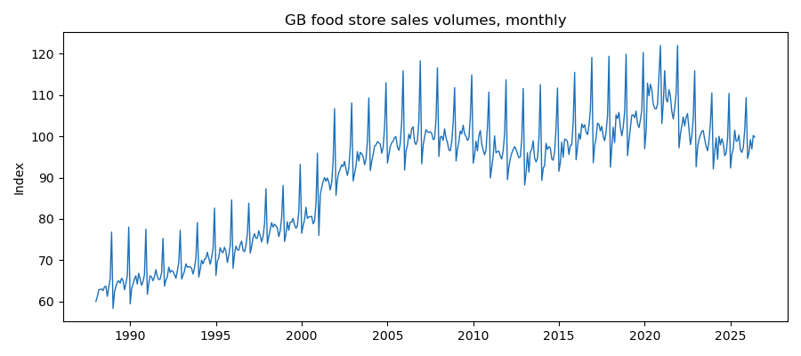
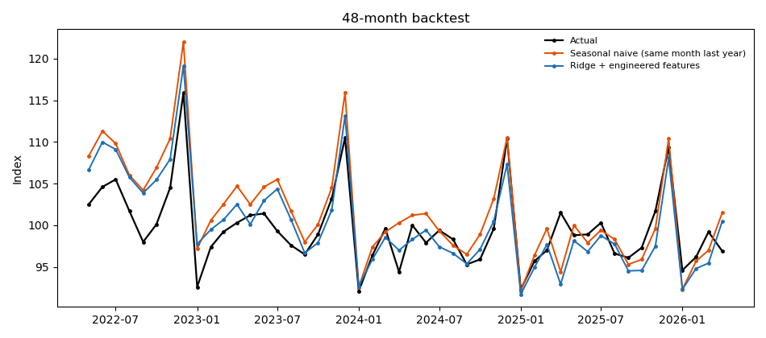
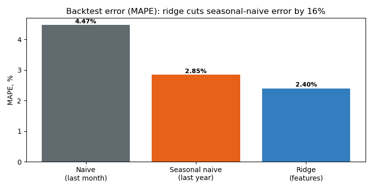
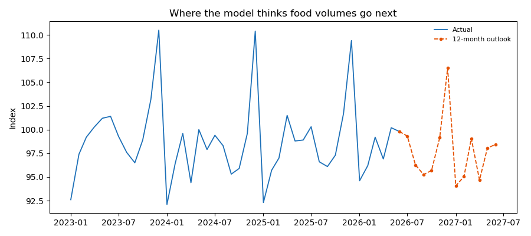

# UK Food Demand Forecasting

This project forecasts monthly UK food retail demand using the ONS EAGW series. The goal is to beat the seasonal naive benchmark and translate the improvement into a simple waste-savings story.

## Data

The project uses the ONS monthly food store sales volume series, which runs from 1988 to 2026.

## Method

I built a 48-month backtest from May 2022 to April 2026 and compared three approaches:
- naive last month
- seasonal naive, which repeats the same month last year
- ridge regression with engineered features

The feature set includes lagged values, rolling averages, month seasonality, Easter timing, and a flag for the pandemic period.

## Results

The ridge model beats seasonal naive on the backtest.

## Business Value

The forecast improvement is converted into rough annual savings scenarios based on avoidable food waste.

## Outputs

The repo includes:

- [Backtest predictions CSV](outputs/backtest_predictions.csv)
- [Metrics CSV](outputs/metrics.csv)
- [Waste scenarios CSV](outputs/waste_scenarios.csv)
- [Next 12 months forecast CSV](outputs/forecast_next_12m.csv)

### Charts








## Limitations

This is a simplified forecasting project. The waste numbers are scenario estimates, not measured savings.

## How to run

```bash
python run.py